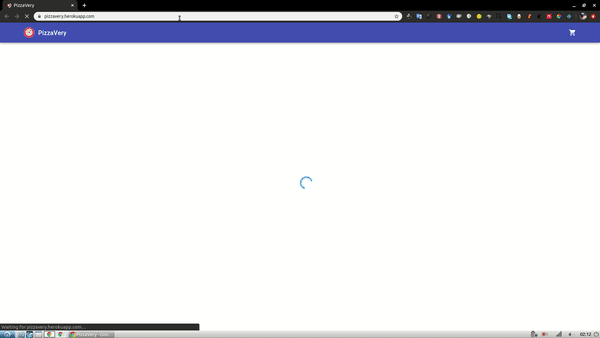

# Simple Web App for a pizza delivery use case

  

  See a demo on [https://pizzavery.herokuapp.com](https://pizzavery.herokuapp.com).

  Simple Web APP developed with React-Redux, Express and Material-UI. For database management
  it is used Knex (migrations, seeds and queries). For provisioning it was used docker-compose.

  Database is populated with data extracted from
  [Datafiniti](https://data.world/datafiniti/pizza-restaurants-and-pizzas-on-their-menus) pizza dataset. Data was extracted and cleaned with python's pandas. Also pizza images were taken from [PizzaGAN](http://pizzagan.csail.mit.edu/) dataset.


## How to run

  Altough this app is deployed as a Heroku App at
  [https://pizzavery.herokuapp.com](https://pizzavery.herokuapp.com), you can
  deploy it in your PC with docker-compose.

``` docker-compose build && docker-compose up```
